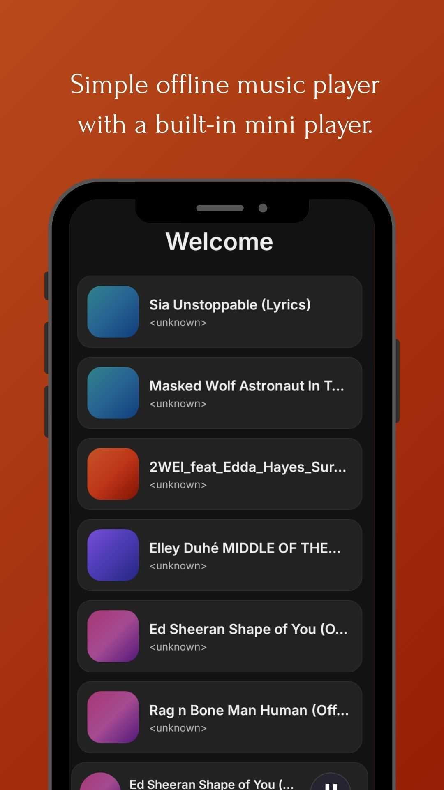
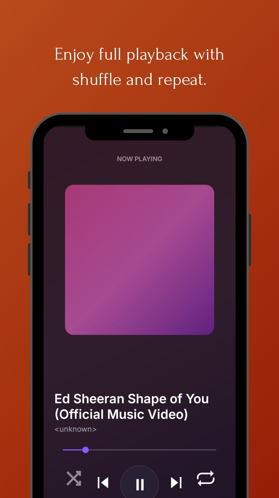

> Pulse is currently under active development.
# Pulse

Pulse is an offline Android music player focused on simplicity, performance, and a clean user experience.

## Features

- Offline music playback
- Mini player
- Shuffle mode
- Repeat modes (Repeat All / Repeat One)
- Local music library scanning
- Runtime permission handling
- Custom Material Design interface

## Built with

- Java
- Android SDK
- AndroidX Media3 (ExoPlayer)
- RecyclerView
- Material Components

## Screenshots

## Download

Download the latest APK from the **Releases** section.

## Installation

1. Download the latest APK from **Releases**.
2. Install the APK on your Android device.
3. Android may display a security warning because the application is distributed outside Google Play.
4. Confirm the installation and launch Pulse.

## Available Versions

- v1.0.0

## License

This project is licensed under the MIT License.
